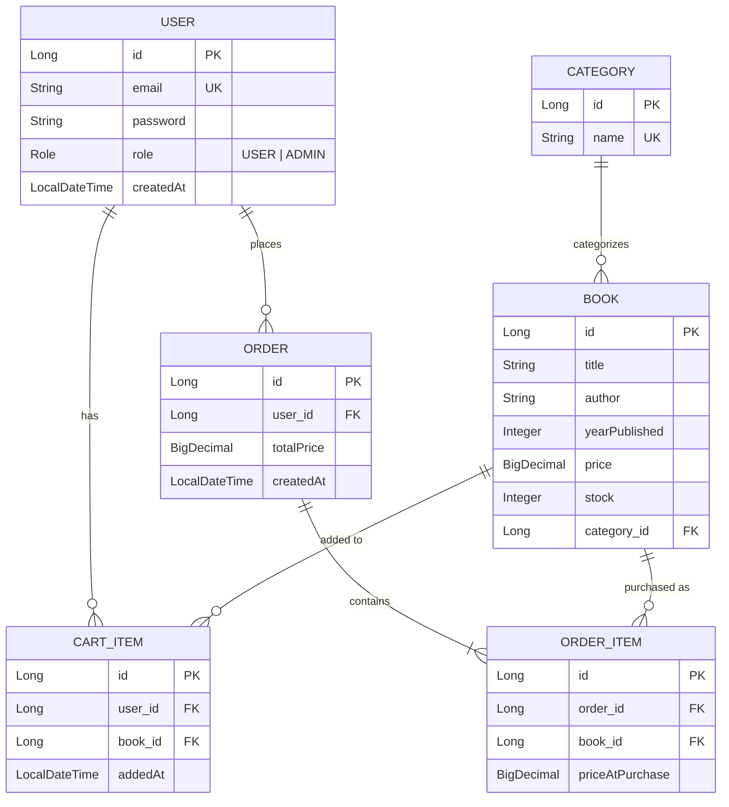
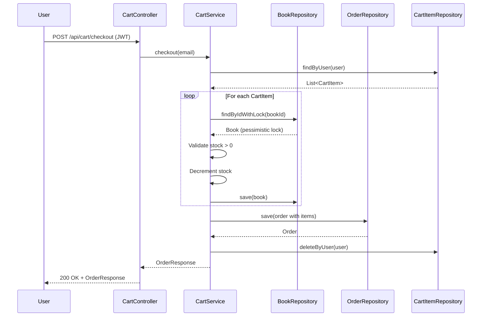

# 📚 Bookshop API

A RESTful online bookshop API built with **Java 21** and **Spring Boot 3.4**. Supports user registration/login, book browsing, cart management, and checkout with role-based access control (Admin/User).

---

## 📐 Low-Level Design (LLD)

### Entity Relationship Diagram



### Class Diagram (Layered Architecture)

```mermaid
classDiagram
    direction TB

    class AuthController {
        +register(AuthRequest) AuthResponse
        +login(AuthRequest) AuthResponse
    }

    class BookController {
        +getBooks(categoryIds, pageable) Page~BookResponse~
        +getBookById(id) BookResponse
    }

    class CategoryController {
        +getAllCategories() List~CategoryResponse~
        +getCategoryById(id) CategoryResponse
    }

    class AdminController {
        +createCategory(CategoryRequest) CategoryResponse
        +updateCategory(id, CategoryRequest) CategoryResponse
        +deleteCategory(id) void
        +createBook(BookRequest) BookResponse
        +updateBook(id, BookUpdateRequest) BookResponse
        +deleteBook(id) void
    }

    class CartController {
        +getCart(user) List~CartItemResponse~
        +addToCart(user, bookId) CartItemResponse
        +removeFromCart(user, bookId) void
        +checkout(user) OrderResponse
    }

    class OrderController {
        +getOrders(user) List~OrderResponse~
    }

    class AuthService {
        +register(AuthRequest) AuthResponse
        +login(AuthRequest) AuthResponse
    }

    class BookService {
        +getBooks(categoryIds, pageable) Page~BookResponse~
        +getBookById(id) BookResponse
        +createBook(BookRequest) BookResponse
        +updateBook(id, BookUpdateRequest) BookResponse
        +deleteBook(id) void
    }

    class CategoryService {
        +getAllCategories() List~CategoryResponse~
        +getCategoryById(id) CategoryResponse
        +createCategory(CategoryRequest) CategoryResponse
        +updateCategory(id, CategoryRequest) CategoryResponse
        +deleteCategory(id) void
    }

    class CartService {
        +getCart(email) List~CartItemResponse~
        +addToCart(email, bookId) CartItemResponse
        +removeFromCart(email, bookId) void
        +checkout(email) OrderResponse
        +getOrders(email) List~OrderResponse~
    }

    class JwtService {
        +generateToken(email, role) String
        +extractUsername(token) String
        +isTokenValid(token, userDetails) boolean
    }

    class JwtAuthenticationFilter {
        +doFilterInternal(request, response, chain) void
    }

    AuthController --> AuthService
    BookController --> BookService
    CategoryController --> CategoryService
    AdminController --> BookService
    AdminController --> CategoryService
    CartController --> CartService
    OrderController --> CartService
    AuthService --> JwtService
    JwtAuthenticationFilter --> JwtService
```



### Sequence Diagram – Checkout Flow



---

## 🛠️ Tech Stack

| Technology | What | How / Why |
|---|---|---|
| **Java 21** | Programming Language | LTS release with modern features (records, pattern matching, virtual threads support) |
| **Spring Boot 3.4.4** | Application Framework | Auto-configuration, embedded Tomcat, dependency injection, production-ready defaults |
| **Spring Security 6** | Authentication & Authorization | Stateless JWT-based auth with role-based access control (ADMIN/USER). Custom `JwtAuthenticationFilter` intercepts every request |
| **Spring Data JPA** | Data Access Layer | Repository pattern with auto-generated CRUD queries. Custom JPQL for filtered/paginated book queries and pessimistic locking during checkout |
| **Hibernate 6.6** | ORM (Object-Relational Mapping) | Entity mapping with `@Entity`, `@ManyToOne`, `@OneToMany`. Lazy loading for relationships, `@Builder` pattern for entity creation |
| **H2 Database** | Embedded SQL Database | File-based persistence (`./data/bookshopdb`). Zero-config, perfect for development. H2 Console enabled at `/h2-console` |
| **JWT (JJWT 0.12)** | Token-based Authentication | HS512 signed tokens with 24h expiry. Claims include email and role. Stateless – no server-side session storage |
| **Lombok** | Boilerplate Reduction | `@Data`, `@Builder`, `@RequiredArgsConstructor`, `@Slf4j` – eliminates getters/setters/constructors/loggers |
| **Jakarta Validation** | Input Validation | `@NotBlank`, `@Email`, `@DecimalMin`, `@Size` on DTOs. Validated at controller layer with `@Valid` |
| **Maven** | Build Tool | Dependency management, build lifecycle, test execution via Maven Wrapper (`./mvnw`) |
| **JUnit 5 + MockMvc** | Testing | 24 integration tests covering auth, CRUD, cart, checkout, validation, and authorization |

### Architecture Decisions

- **Stateless JWT Auth**: No sessions. Each request carries a JWT token. The `JwtAuthenticationFilter` validates the token and sets the `SecurityContext`.
- **Pessimistic Locking on Checkout**: `@Lock(PESSIMISTIC_WRITE)` on `findByIdWithLock()` prevents race conditions when multiple users checkout the same book simultaneously.
- **Cart Expiry Scheduler**: A `@Scheduled` job runs every 10 minutes to remove cart items older than 30 minutes, freeing up inventory.
- **DTO Pattern**: Request/Response DTOs decouple API contracts from entity internals. `BookResponse.from(Book)` static factory methods handle mapping.
- **Global Exception Handling**: `@RestControllerAdvice` catches `ResourceNotFoundException` (404), `BadRequestException` (400), `ConflictException` (409), and validation errors.
- **Role-Based Security**: `/api/admin/**` endpoints require `ADMIN` role. `/api/cart/**` and `/api/orders/**` require authentication. `/api/books/**` and `/api/categories/**` are public.

---

## 🚀 How to Run

### Prerequisites
- **Java 21+** (`java -version`)
- **Git** (`git --version`)

### 1. Clone & Run

```bash
git clone https://github.com/nitish2904/toptal.git
cd toptal/bookshop
./mvnw spring-boot:run
```

The app starts on **http://localhost:8080**.  
A default admin user is auto-created: `admin@bookshop.com` / `admin123`

### 2. Run Tests

```bash
cd bookshop
./mvnw test
```

Output: `Tests run: 24, Failures: 0, Errors: 0, Skipped: 0 – BUILD SUCCESS`

### 3. Access H2 Database Console

Open http://localhost:8080/h2-console  
- JDBC URL: `jdbc:h2:file:./data/bookshopdb`
- User: `sa`  
- Password: *(empty)*

---

## 📡 API Reference

**Base URL**: `http://localhost:8080`

### Authentication

#### Register
```
POST /api/auth/register
Content-Type: application/json

{
  "email": "user@example.com",
  "password": "password123"
}
```
**Response** (201 Created):
```json
{
  "token": "eyJhbGciOiJIUzUxMiJ9...",
  "email": "user@example.com",
  "role": "USER"
}
```

#### Login
```
POST /api/auth/login
Content-Type: application/json

{
  "email": "admin@bookshop.com",
  "password": "admin123"
}
```
**Response** (200 OK):
```json
{
  "token": "eyJhbGciOiJIUzUxMiJ9...",
  "email": "admin@bookshop.com",
  "role": "ADMIN"
}
```

---

### Categories (Public Read, Admin Write)

#### List All Categories
```
GET /api/categories
```
**Response** (200 OK):
```json
[
  { "id": 1, "name": "Fiction" },
  { "id": 2, "name": "Science" }
]
```

#### Get Category by ID
```
GET /api/categories/{id}
```

#### Create Category (Admin only)
```
POST /api/admin/categories
Authorization: Bearer <ADMIN_TOKEN>
Content-Type: application/json

{ "name": "Fiction" }
```
**Response** (201 Created):
```json
{ "id": 1, "name": "Fiction" }
```

#### Update Category (Admin only)
```
PUT /api/admin/categories/{id}
Authorization: Bearer <ADMIN_TOKEN>
Content-Type: application/json

{ "name": "Updated Name" }
```
**Response** (200 OK):
```json
{ "id": 1, "name": "Updated Name" }
```

#### Delete Category (Admin only)
```
DELETE /api/admin/categories/{id}
Authorization: Bearer <ADMIN_TOKEN>
```
**Response**: 204 No Content

---

### Books (Public Read, Admin Write)

#### List Books (paginated, filterable)
```
GET /api/books
GET /api/books?category=1
GET /api/books?category=1,2&page=0&size=10&sort=title,asc
```
**Response** (200 OK):
```json
{
  "content": [
    {
      "id": 1,
      "title": "The Great Gatsby",
      "author": "F. Scott Fitzgerald",
      "yearPublished": 1925,
      "price": 12.99,
      "stock": 5,
      "category": { "id": 1, "name": "Fiction" }
    }
  ],
  "totalElements": 1,
  "totalPages": 1,
  "size": 20,
  "number": 0
}
```
> **Note**: Only books with `stock > 0` are shown. Sold-out books are hidden.

#### Get Book by ID
```
GET /api/books/{id}
```
**Response** (200 OK):
```json
{
  "id": 1,
  "title": "The Great Gatsby",
  "author": "F. Scott Fitzgerald",
  "yearPublished": 1925,
  "price": 12.99,
  "stock": 5,
  "category": { "id": 1, "name": "Fiction" }
}
```

#### Create Book (Admin only)
```
POST /api/admin/books
Authorization: Bearer <ADMIN_TOKEN>
Content-Type: application/json

{
  "title": "The Great Gatsby",
  "author": "F. Scott Fitzgerald",
  "yearPublished": 1925,
  "price": 12.99,
  "stock": 5,
  "categoryId": 1
}
```
**Response** (201 Created): Same as Get Book

#### Update Book (Admin only)
```
PUT /api/admin/books/{id}
Authorization: Bearer <ADMIN_TOKEN>
Content-Type: application/json

{
  "title": "Updated Title",
  "author": "Author",
  "yearPublished": 2024,
  "price": 19.99,
  "categoryId": 1
}
```
> **Note**: `stock` is NOT updatable via update endpoint.

#### Delete Book (Admin only)
```
DELETE /api/admin/books/{id}
Authorization: Bearer <ADMIN_TOKEN>
```
**Response**: 204 No Content

---

### Cart (Authenticated Users)

#### View Cart
```
GET /api/cart
Authorization: Bearer <USER_TOKEN>
```
**Response** (200 OK):
```json
[
  {
    "id": 1,
    "bookId": 1,
    "bookTitle": "The Great Gatsby",
    "bookAuthor": "F. Scott Fitzgerald",
    "bookPrice": 12.99,
    "addedAt": "2026-03-28T14:04:17.672708"
  }
]
```

#### Add Book to Cart
```
POST /api/cart/items/{bookId}
Authorization: Bearer <USER_TOKEN>
```
**Response** (201 Created):
```json
{
  "id": 1,
  "bookId": 1,
  "bookTitle": "The Great Gatsby",
  "bookAuthor": "F. Scott Fitzgerald",
  "bookPrice": 12.99,
  "addedAt": "2026-03-28T14:04:17.672708"
}
```
**Error cases**:
- `404` – Book not found
- `400` – Book is out of stock
- `409` – Book already in cart

#### Remove Book from Cart
```
DELETE /api/cart/items/{bookId}
Authorization: Bearer <USER_TOKEN>
```
**Response**: 204 No Content

#### Checkout
```
POST /api/cart/checkout
Authorization: Bearer <USER_TOKEN>
```
**Response** (200 OK):
```json
{
  "id": 1,
  "totalPrice": 28.49,
  "createdAt": "2026-03-28T14:04:17.825792",
  "items": [
    {
      "bookId": 1,
      "bookTitle": "The Great Gatsby",
      "bookAuthor": "F. Scott Fitzgerald",
      "priceAtPurchase": 12.99
    },
    {
      "bookId": 2,
      "bookTitle": "Cosmos",
      "bookAuthor": "Carl Sagan",
      "priceAtPurchase": 15.50
    }
  ]
}
```
**What happens on checkout**:
- Each book's stock is decremented by 1 (with pessimistic locking)
- An Order is created with OrderItems capturing price at time of purchase
- Cart is cleared
- Returns the created Order

**Error cases**:
- `400` – Cart is empty
- `400` – A book in cart is no longer in stock

---

### Orders (Authenticated Users)

#### View Order History
```
GET /api/orders
Authorization: Bearer <USER_TOKEN>
```
**Response** (200 OK):
```json
[
  {
    "id": 1,
    "totalPrice": 28.49,
    "createdAt": "2026-03-28T14:04:17.825792",
    "items": [
      {
        "bookId": 1,
        "bookTitle": "The Great Gatsby",
        "bookAuthor": "F. Scott Fitzgerald",
        "priceAtPurchase": 12.99
      }
    ]
  }
]
```

---

### Error Responses

All errors follow a consistent format:

```json
{
  "status": 404,
  "error": "Not Found",
  "message": "Book not found with id: 99"
}
```

| Status Code | When |
|---|---|
| `400 Bad Request` | Validation errors, empty cart checkout, out-of-stock |
| `401 Unauthorized` | Invalid credentials on login |
| `403 Forbidden` | Missing/invalid JWT token, insufficient role |
| `404 Not Found` | Resource doesn't exist |
| `409 Conflict` | Duplicate email registration, book already in cart |

---

## 📁 Project Structure

```
bookshop/
├── src/main/java/com/toptal/bookshop/
│   ├── BookshopApplication.java          # Main entry point
│   ├── config/
│   │   ├── SecurityConfig.java           # Spring Security configuration
│   │   └── DataInitializer.java          # Seeds default admin user
│   ├── controller/
│   │   ├── AuthController.java           # POST /api/auth/register, /login
│   │   ├── BookController.java           # GET /api/books (public)
│   │   ├── CategoryController.java       # GET /api/categories (public)
│   │   ├── AdminController.java          # /api/admin/** (ADMIN only)
│   │   ├── CartController.java           # /api/cart/** (authenticated)
│   │   └── OrderController.java          # GET /api/orders (authenticated)
│   ├── dto/                              # Request/Response DTOs
│   ├── entity/                           # JPA Entities (User, Book, Category, CartItem, Order, OrderItem)
│   ├── exception/                        # Custom exceptions + GlobalExceptionHandler
│   ├── repository/                       # Spring Data JPA repositories
│   ├── security/                         # JWT service, filter, UserDetailsService
│   └── service/                          # Business logic (AuthService, BookService, CartService, etc.)
├── src/test/
│   ├── java/.../BookshopIntegrationTest.java  # 24 integration tests
│   └── resources/application-test.properties  # H2 in-memory config for tests
└── pom.xml
```
