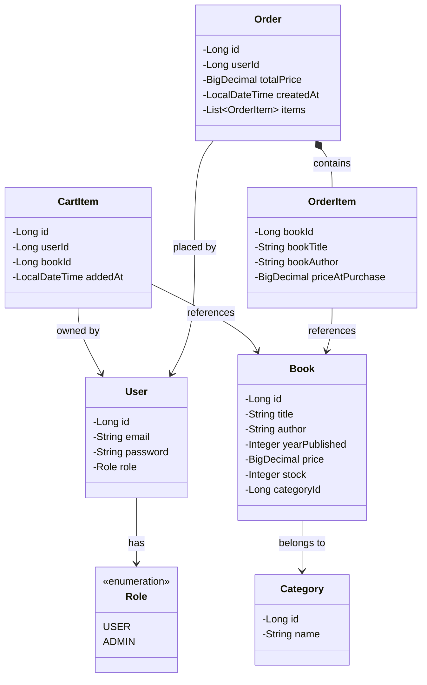
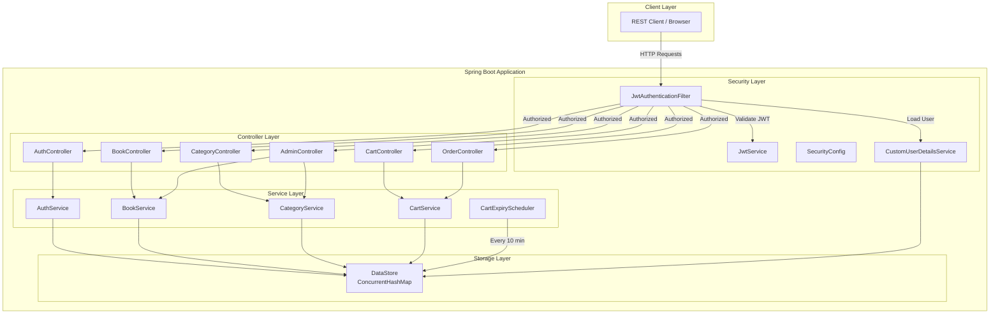
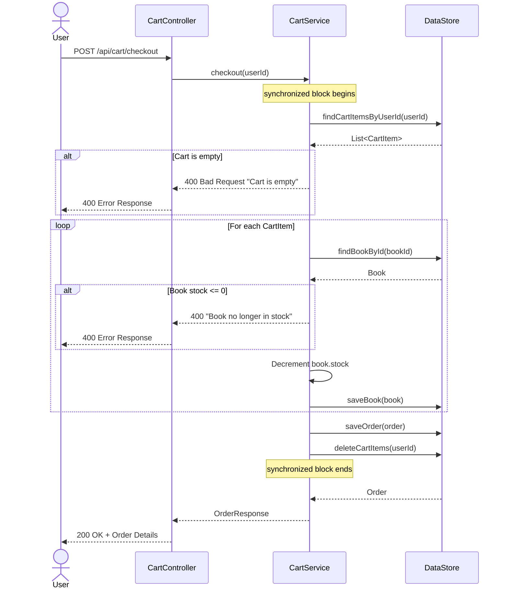
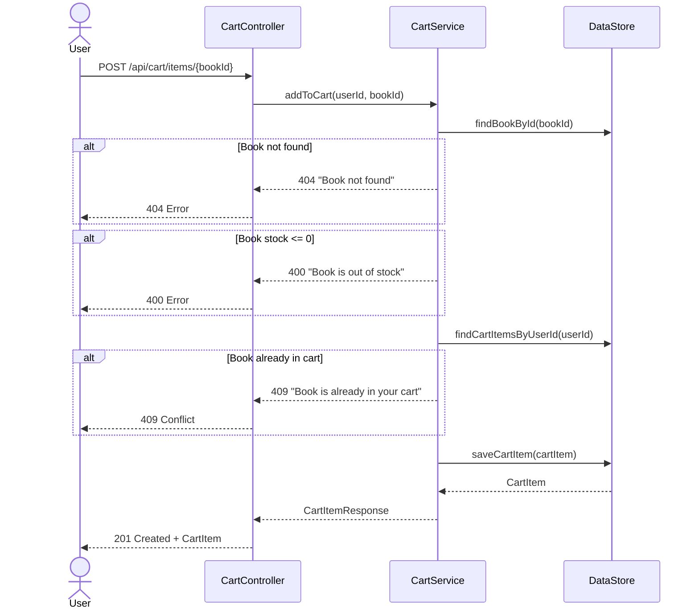
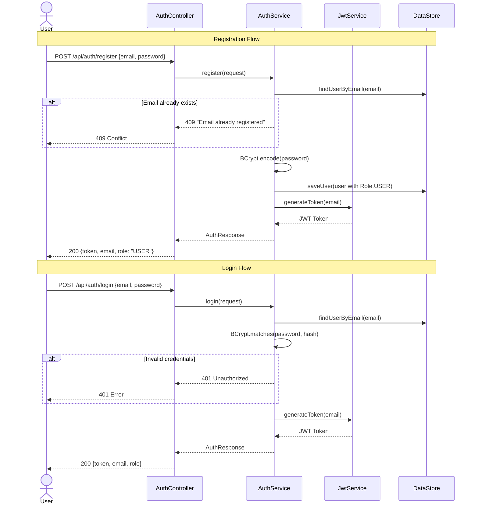
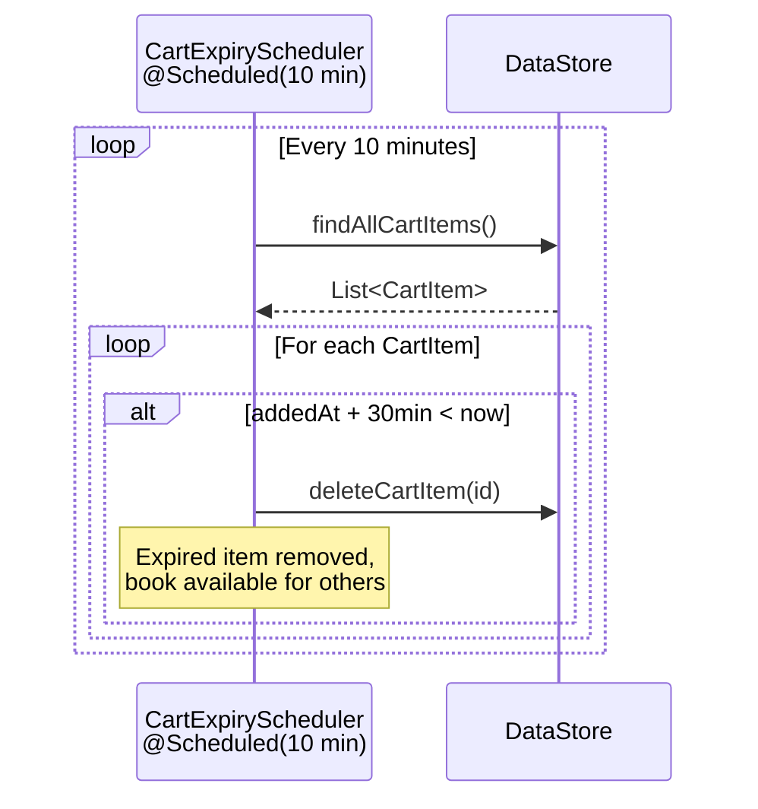

# Bookshop API v2 – In-Memory HashMap Storage

A RESTful Bookshop API built with **Java 21** and **Spring Boot 3.4** using **in-memory ConcurrentHashMap** storage (no database required). Features JWT authentication, role-based access control, cart management with expiry, and race-condition-safe checkout.

## Tech Stack

- **Java 21** + **Spring Boot 3.4.4**
- **Spring Security** with JWT (jjwt 0.12.6)
- **In-Memory Storage** – ConcurrentHashMap (no JPA, no database)
- **Bean Validation** (jakarta.validation)
- **Swagger/OpenAPI** (springdoc-openapi)
- **Lombok**

## How to Run

### Prerequisites
- Java 21+

### Start the Application

```bash
cd bookshopv2
./mvnw spring-boot:run
```

The server starts on **http://localhost:8081**.

### Swagger UI

Open **http://localhost:8081/swagger-ui.html** to explore all endpoints interactively.

### Default Admin Account

On startup, a default admin user is created:
- **Email:** `admin@bookshop.com`
- **Password:** `admin123`

> **Note:** Users can only be promoted to admin by directly modifying the `DataStore` (equivalent of direct DB access). There is no API endpoint to change user roles.

---

## API Endpoints

| Method | Endpoint | Auth | Description |
|--------|----------|------|-------------|
| POST | `/api/auth/register` | None | Register a new user |
| POST | `/api/auth/login` | None | Login and get JWT token |
| GET | `/api/books` | None | Browse books (with filtering, sorting, pagination) |
| GET | `/api/books/{id}` | None | Get a specific book |
| GET | `/api/categories` | None | List all categories |
| GET | `/api/categories/{id}` | None | Get a specific category |
| POST | `/api/admin/categories` | Admin | Create category |
| PUT | `/api/admin/categories/{id}` | Admin | Update category |
| DELETE | `/api/admin/categories/{id}` | Admin | Delete category |
| POST | `/api/admin/books` | Admin | Create book |
| PUT | `/api/admin/books/{id}` | Admin | Update book (stock not editable) |
| DELETE | `/api/admin/books/{id}` | Admin | Delete book |
| GET | `/api/cart` | User | View cart |
| POST | `/api/cart/items/{bookId}` | User | Add book to cart |
| DELETE | `/api/cart/items/{bookId}` | User | Remove book from cart |
| POST | `/api/cart/checkout` | User | Checkout (buy all books in cart) |
| GET | `/api/orders` | User | View order history |

---

## UML Diagrams

> **Complete LLD:** See [`docs/lld-complete.puml`](docs/lld-complete.puml) for the full Low-Level Design in a single PlantUML file covering all layers (Model, DTO, DataStore, Service, Security, Controller, Config, Exceptions).
>
> **Individual diagrams** are also available as separate `.puml` files in the [`docs/`](docs/) folder: class-diagram, component-diagram, checkout-sequence, add-to-cart-sequence, auth-sequence.
>
> To render: use [PlantUML Online](https://www.plantuml.com/plantuml/uml/), IntelliJ PlantUML plugin, or VS Code PlantUML extension.


### Domain Model (Class Diagram)



### Architecture / Component Diagram



### Checkout Sequence Diagram



### Add to Cart Sequence Diagram



### Authentication Flow



### Cart Expiry Flow



---

## Functional Requirements & Test Scenarios

### 1. User Registration & Authentication

Register and login with email + password. JWT token returned on success.

```bash
# Register
curl -s -X POST http://localhost:8081/api/auth/register \
  -H "Content-Type: application/json" \
  -d '{"email":"user@example.com","password":"password123"}'
# Response: {"token":"eyJ...","email":"user@example.com","role":"USER"}

# Login
curl -s -X POST http://localhost:8081/api/auth/login \
  -H "Content-Type: application/json" \
  -d '{"email":"user@example.com","password":"password123"}'
# Response: {"token":"eyJ...","email":"user@example.com","role":"USER"}
```

### 2. Admin Only via DB (Not API)

Registration always creates a USER role. There is no API to promote users to admin. Admin users can only be created by modifying the DataStore directly (equivalent of database access).

```bash
# Register always gives USER role
curl -s -X POST http://localhost:8081/api/auth/register \
  -H "Content-Type: application/json" \
  -d '{"email":"wannabe-admin@test.com","password":"password123"}'
# Response: role is always "USER"
```

### 3. Admin CRUD Categories

Only admins can create, update, and delete categories. Categories are flat (no nesting).

```bash
# Login as admin first
ADMIN_TOKEN=$(curl -s -X POST http://localhost:8081/api/auth/login \
  -H "Content-Type: application/json" \
  -d '{"email":"admin@bookshop.com","password":"admin123"}' | jq -r .token)

# Create category
curl -s -X POST http://localhost:8081/api/admin/categories \
  -H "Authorization: Bearer $ADMIN_TOKEN" \
  -H "Content-Type: application/json" \
  -d '{"name":"Fiction"}'
# Response: {"id":1,"name":"Fiction"}

# Update category
curl -s -X PUT http://localhost:8081/api/admin/categories/1 \
  -H "Authorization: Bearer $ADMIN_TOKEN" \
  -H "Content-Type: application/json" \
  -d '{"name":"Science Fiction"}'
# Response: {"id":1,"name":"Science Fiction"}

# Delete category (fails if books exist in it)
curl -s -X DELETE http://localhost:8081/api/admin/categories/1 \
  -H "Authorization: Bearer $ADMIN_TOKEN"
# Response: 204 No Content (or 400 if books exist)

# Non-admin gets 403
USER_TOKEN=$(curl -s -X POST http://localhost:8081/api/auth/login \
  -H "Content-Type: application/json" \
  -d '{"email":"user@example.com","password":"password123"}' | jq -r .token)

curl -s -X POST http://localhost:8081/api/admin/categories \
  -H "Authorization: Bearer $USER_TOKEN" \
  -H "Content-Type: application/json" \
  -d '{"name":"Hacking"}'
# Response: 403 Forbidden
```

### 4. Admin CRUD Books (Stock Not Editable After Creation)

Books have title, author, year published, price, stock, and category. Stock can only be set during creation – it cannot be changed via the update endpoint.

```bash
# Create book with stock=5
curl -s -X POST http://localhost:8081/api/admin/books \
  -H "Authorization: Bearer $ADMIN_TOKEN" \
  -H "Content-Type: application/json" \
  -d '{"title":"Dune","author":"Frank Herbert","yearPublished":1965,"price":12.99,"stock":5,"categoryId":1}'
# Response: {"id":1,"title":"Dune","author":"Frank Herbert","yearPublished":1965,"price":12.99,"stock":5,"category":{"id":1,"name":"Science Fiction"}}

# Update book – note: no stock field in update request, stock stays at 5
curl -s -X PUT http://localhost:8081/api/admin/books/1 \
  -H "Authorization: Bearer $ADMIN_TOKEN" \
  -H "Content-Type: application/json" \
  -d '{"title":"Dune (Updated Edition)","author":"Frank Herbert","yearPublished":1965,"price":14.99,"categoryId":1}'
# Response: stock remains 5

# Delete book
curl -s -X DELETE http://localhost:8081/api/admin/books/1 \
  -H "Authorization: Bearer $ADMIN_TOKEN"
# Response: 204 No Content
```

### 5. Sold-Out Books Hidden from Listing & Cannot Be Purchased

Books with stock=0 are excluded from the GET /api/books listing and cannot be added to cart.

```bash
# Create a book with stock=0
curl -s -X POST http://localhost:8081/api/admin/books \
  -H "Authorization: Bearer $ADMIN_TOKEN" \
  -H "Content-Type: application/json" \
  -d '{"title":"Sold Out Book","author":"Nobody","yearPublished":2020,"price":5.00,"stock":0,"categoryId":1}'

# List books – sold-out book will NOT appear
curl -s http://localhost:8081/api/books | jq '.content[].title'
# "Sold Out Book" is NOT in the list

# Try to add sold-out book to cart
curl -s -X POST http://localhost:8081/api/cart/items/2 \
  -H "Authorization: Bearer $USER_TOKEN"
# Response: 400 {"message":"Book is out of stock"}
```

### 6. Unauthenticated Browsing & Filtering

Anyone (including unauthenticated visitors) can browse and filter books.

```bash
# Browse all in-stock books (no auth needed)
curl -s http://localhost:8081/api/books
# Response: paginated list with content, totalElements, totalPages

# Filter by category
curl -s "http://localhost:8081/api/books?category=1"

# Sort by price descending
curl -s "http://localhost:8081/api/books?sortBy=price&sortDir=desc"

# Pagination
curl -s "http://localhost:8081/api/books?page=0&size=10"

# Combined
curl -s "http://localhost:8081/api/books?category=1&sortBy=title&sortDir=asc&page=0&size=5"

# Browse categories
curl -s http://localhost:8081/api/categories
```

### 7. Cart – One Copy Per Book

Authenticated users can add books to their cart (one copy per book). Adding the same book twice returns 409 Conflict.

```bash
# Add book to cart
curl -s -X POST http://localhost:8081/api/cart/items/1 \
  -H "Authorization: Bearer $USER_TOKEN"
# Response: 201 {"id":1,"bookId":1,"bookTitle":"Dune","bookAuthor":"Frank Herbert","bookPrice":12.99,"addedAt":"..."}

# Try adding same book again
curl -s -X POST http://localhost:8081/api/cart/items/1 \
  -H "Authorization: Bearer $USER_TOKEN"
# Response: 409 {"message":"Book is already in your cart"}

# View cart
curl -s http://localhost:8081/api/cart \
  -H "Authorization: Bearer $USER_TOKEN"

# Remove from cart
curl -s -X DELETE http://localhost:8081/api/cart/items/1 \
  -H "Authorization: Bearer $USER_TOKEN"
# Response: 204 No Content
```

### 8. Checkout – Clears Cart & Reduces Stock

Checkout "buys" all books in the cart: creates an order, reduces stock for each book, and clears the cart. No credit card details required.

```bash
# Add a book and checkout
curl -s -X POST http://localhost:8081/api/cart/items/1 \
  -H "Authorization: Bearer $USER_TOKEN"

# Check stock before
curl -s http://localhost:8081/api/books/1 | jq '.stock'
# Output: 5

# Checkout
curl -s -X POST http://localhost:8081/api/cart/checkout \
  -H "Authorization: Bearer $USER_TOKEN"
# Response: {"id":1,"totalPrice":12.99,"createdAt":"...","items":[{"bookId":1,"bookTitle":"Dune","bookAuthor":"Frank Herbert","priceAtPurchase":12.99}]}

# Check stock after
curl -s http://localhost:8081/api/books/1 | jq '.stock'
# Output: 4

# Cart is now empty
curl -s http://localhost:8081/api/cart \
  -H "Authorization: Bearer $USER_TOKEN"
# Output: []

# View order history
curl -s http://localhost:8081/api/orders \
  -H "Authorization: Bearer $USER_TOKEN"
```

### 9. Race Condition Prevention

When two users try to buy the same last-copy book simultaneously, only one succeeds. The `checkout` method is `synchronized` to prevent double-selling.

```bash
# Admin creates a book with stock=1
curl -s -X POST http://localhost:8081/api/admin/books \
  -H "Authorization: Bearer $ADMIN_TOKEN" \
  -H "Content-Type: application/json" \
  -d '{"title":"Last Copy","author":"Rare Author","yearPublished":2024,"price":20.00,"stock":1,"categoryId":1}'

# Register two users
USER_A=$(curl -s -X POST http://localhost:8081/api/auth/register \
  -H "Content-Type: application/json" \
  -d '{"email":"usera@test.com","password":"pass123"}' | jq -r .token)

USER_B=$(curl -s -X POST http://localhost:8081/api/auth/register \
  -H "Content-Type: application/json" \
  -d '{"email":"userb@test.com","password":"pass123"}' | jq -r .token)

# Both add the book to their carts
curl -s -X POST http://localhost:8081/api/cart/items/3 -H "Authorization: Bearer $USER_A"
curl -s -X POST http://localhost:8081/api/cart/items/3 -H "Authorization: Bearer $USER_B"

# Both checkout simultaneously
curl -s -X POST http://localhost:8081/api/cart/checkout -H "Authorization: Bearer $USER_A" > /tmp/a.json &
curl -s -X POST http://localhost:8081/api/cart/checkout -H "Authorization: Bearer $USER_B" > /tmp/b.json &
wait

cat /tmp/a.json  # One succeeds with order
cat /tmp/b.json  # Other fails with: "Book 'Last Copy' is no longer in stock"
```

### 10. Cart Expiry (30 Minutes)

Books added to the cart are automatically removed after 30 minutes if not purchased. A background scheduler (`CartExpiryScheduler`) runs every 10 minutes and cleans up expired cart items.

**Configuration** (in `application.properties`):
```properties
app.cart.expiry-minutes=30
```

The scheduler uses `@Scheduled(fixedRate = 600000)` (every 10 minutes) and removes all cart items with `addedAt` older than 30 minutes.

---

## Project Structure

```
bookshopv2/
├── pom.xml
├── src/main/java/com/toptal/bookshopv2/
│   ├── BookshopV2Application.java       # Main application entry point
│   ├── config/
│   │   ├── DataInitializer.java         # Creates default admin user
│   │   ├── OpenApiConfig.java           # Swagger/OpenAPI configuration
│   │   └── SecurityConfig.java          # Spring Security + JWT config
│   ├── controller/
│   │   ├── AdminController.java         # Admin CRUD for books & categories
│   │   ├── AuthController.java          # Registration & login
│   │   ├── BookController.java          # Public book browsing
│   │   ├── CartController.java          # Cart operations
│   │   ├── CategoryController.java      # Public category browsing
│   │   └── OrderController.java         # Order history
│   ├── dto/                             # Request/Response DTOs
│   ├── exception/                       # Custom exceptions + global handler
│   ├── model/                           # Plain Java POJOs (no JPA)
│   ├── security/                        # JWT service, filter, user details
│   ├── service/                         # Business logic
│   │   ├── AuthService.java
│   │   ├── BookService.java
│   │   ├── CartExpiryScheduler.java     # Background cart cleanup
│   │   ├── CartService.java             # Cart + checkout + orders
│   │   └── CategoryService.java
│   └── store/
│       └── DataStore.java               # ConcurrentHashMap-based storage
└── src/main/resources/
    └── application.properties
```

## Key Design Decisions

1. **In-Memory Storage**: All data lives in `ConcurrentHashMap` via a centralized `DataStore` component. No database, no JPA, no Hibernate.
2. **Thread Safety**: `ConcurrentHashMap` for storage + `synchronized` checkout method prevents race conditions on stock.
3. **Stock Immutability**: `BookUpdateRequest` DTO intentionally excludes the `stock` field, making stock unchangeable after creation (only reduced by purchases).
4. **Cart Expiry**: Background scheduler periodically cleans up stale cart items (configurable via `app.cart.expiry-minutes`).
5. **Data Loss on Restart**: Since storage is in-memory, all data is lost when the application restarts. The default admin user is re-created on each startup.
